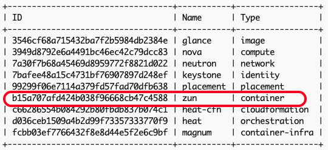

# Chapter 04
## OpenStack Compute – Compute Capacity and Flavors

## Description

The Chapter extends and uses the deployment of a multi-node OpenStack environment as described in [Chapter03](https://github.com/PacktPublishing/Mastering-OpenStack-Third-Edition/tree/main/Chapter03):
- Add a Compute Node
- Configure Nova Scheduler for Filtering and Weighing 
- Enable OpenStack Magnum for Container Orchestration Engine Provisioning service
- Enable OpenStack Zun for Containers service


<details close>
  <summary>Output</summary>

  ```sh

```

</details>


### System and Software Specs:

The following hardware specifications are used for the additional Compute Node:

| Hostname |vCPUs| RAM | Disk Space | Network Interfaces| Role 
|------|----|---------------|-------------|--------|--------|
| `cn02.os` |`8`| `24GB` | `500GB` | `4 x 10GB` | Compute Node|  

> [!NOTE]
> The mentioned resources are being used in large production environments. Feel free to adjust the specs based on available resources you have but staying with minimum requirements to avoid performance issues. 


The chapter uses the different tools and software versions:

- **Operating System**: Ubuntu 22.04 LTS
- **kolla-ansible**: Latest and stable version from OpenStack Git master branch  (_Description in next section_)
- **Python**: Version 3.X.X
- **Ansible Core**: Any version between ```2.16```  and ```2.17.99```.
- **Jenkins**: Any version for the latest Ubuntu/Debian Jenkins repository (_Description in next section_)


### Code - How-To:

The Chapter uses the kolla-ansible community [repostority](https://github.com/openstack/kolla-ansible).

Make sure you followed instructions to setup Jenkins and CI/CD pipeline for kolla-ansible deployment in [Chapter02](https://github.com/PacktPublishing/Mastering-OpenStack-Third-Edition/tree/main/Chapter02#3setting-up-the-cicd-pipeline)

Required files for Chapter03 are:
- ```ansible/inventory/multi_packtpub_prod``` : Inventory file for multi-node setup
- ```/etc/kolla/globals.yaml``` : OpenStack configurations and parameters 

You can check the branch naming standard used by the OpenStack community in the Github page by clicking on the Switch branches/tags button the top right of the page:


Branches with **stable/** prefix are still maintained. Non maintained OpenStack releases are named with branches with **unmaintained/** prefix. 


## Deployment of Multi-Node OpenStack environment:
### Example Production Topology: 

1. The following topology is being deployed in Multi-Node OpenStack setup:

```
 
```


2. Additional Compute Node IP Allocation:

| Hostname |Role| Network Interface | Network Attachement | IP Address|  
|------|----|---------------|-------------|--------|
| `cn02.os.packtpub` |`Compute Node`| `eth0` | `Management` | `10.0.0.26` | 
|            |             | `eth1` | `Overlay/Tenant` | `10.10.0.26` | 
|            |             | `eth2` | `External` | `10.20.0.26` | 
|            |             | `eth3` | `Storage` | `10.30.0.26` |  


### Deployment prepartion:

1. Update on the Deployer node the hosts file with respective DNS entries of the additional Compute node:

```sh
tee -a /etc/hosts<<EOF
### SECOND COMPUTE NODE
10.0.0.26 cn02.os
EOF
```

2. Setup SSH keys so that the Deployer node can SSH password-less login to the additional Compute node:

```sh
ssh-copy-id -o StrictHostKeyChecking=no ~/.ssh/id_rsa.pub root@cn02.os ; 
```

> [!NOTE]
> You can copy manually the generared `id_rsa.pub` file from the Deployer host to the OpenStack nodes located under `.ssh/authorized_keys`


3. Configure the hostnames and timezone for additional Compute node:

```sh
  ssh root@cn02.os hostnamectl set-hostname cn02.os
  ssh root@cn02.os timedatectl set-timezone Europe/Amsterdam
```

4. Run an update and upgarde of the Ubuntu packages index  in the additional Compute node:

```sh
apt-get update -y; apt-get upgrade -y
```

5. Install Docker engine in the additional Compute node:
 ```sh
sudo apt-get install docker-ce docker-ce-cli containerd.io
```

### Deployment Configuration:
#### Assumptions:
-  Jenkins installed and running in the Deployer Node as explored in [Chapter02](https://github.com/PacktPublishing/Mastering-OpenStack-Third-Edition/blob/main/Chapter02/README.md#3setting-up-the-cicd-pipeline)
-  A local Docker registry is created as described in [Chapter02](https://github.com/PacktPublishing/Mastering-OpenStack-Third-Edition/blob/main/Chapter02/README.md#2-prepare-the-deployment-environment)


1. Copy the `/ansible/inventory/multi_packtpub_prod` inventory file provided [here](https://github.com/PacktPublishing/Mastering-OpenStack-Third-Edition/blob/main/Chapter03/ansible/inventory/multi_packtpub_prod) that includes the additional Compute node:

```sh
...
## Compute Node 
[compute]
cn01.os.packtpub
cn02.os.packtpub

[deployment]
localhost       ansible_connection=local
...
```


2. Create additional configuration of the new Compute Node with CPU and RAM allocation ratios. The content of custom Nova configuration can be found [here](https://github.com/PacktPublishing/Mastering-OpenStack-Third-Edition/blob/main/Chapter04/etc/kolla/config/nova/cn02.os.packtpub/nova.conf). Kolla-ansible will merge the default configuration defined in `globals.yaml` file with the custom configurations for the new Compute Node. The additional configuration includes the following settings:

```sh
cpu_allocation_ratio
ram_allocation_ratio
virt_type=qemu
cpu_mode = none
enabled_filters = ComputeFilter,ComputeCapabilitiesFilter,ImagePropertiesFilter,ServerGroupAntiAffinityFilter,ServerGroupAffinityFilter
weight_classes = nova.scheduler.weights.all_weighers
ram_weight_multiplier = -1.0
``` 
> [!IMPORTANT]
> Kolla-ansible finds custom configuration under `/etc/kolla/config/<< service name >>/<< hostname >>/<< config file >>`. In the previous example, Kolla will merge the additional configurations found in `/etc/kolla/config/nova/cn02.os/nova.conf` file with default Nova configuration. If you intend to path of the custom configuration files, make sure to adjust the variable `node_custom_config` in the `globals.yaml`. 


3. Run the deployment using the  Jenkins Pipeline as described in [Chapter03](https://github.com/PacktPublishing/Mastering-OpenStack-Third-Edition/blob/main/Chapter03/README.md#deployment-configuration). The Pipeline uses the stages provided [here](https://github.com/PacktPublishing/Mastering-OpenStack-Third-Edition/blob/main/Chapter03/Jenkinsfile):

```sh
..
PLAY RECAP ***************************************************************************************************************************************************
...
cn02.os.packtpub                  : ok=32   changed=0    unreachable=0    failed=0    skipped=50   rescued=0    ignored=0   
localhost                         : ok=28   changed=0    unreachable=0    failed=0    skipped=88   rescued=0    ignored=0   
... 
```

> [!TIP]
> The pipeline will initiate the `kolla-ansible bootstrap-servers` command to prepare the additional compute node to the OpenStack environment deployment system. You can optionally dedicate a pipeline for adding new hosts that leverage the `--limit` option in the `kolla-ansible bootstrap-servers` command line and then deploy them. For example, `kolla-ansible -i multi_packtpub_prod  deploy --limit cn02.os` will allow to deploy the compute containers only on the new hosts. 


### Enable Container Service - Magnum

#### Assumptions:
-  Jenkins installed and running in the Deployer Node as explored in [Chapter02](https://github.com/PacktPublishing/Mastering-OpenStack-Third-Edition/blob/main/Chapter02/README.md#3setting-up-the-cicd-pipeline)
-  A local Docker registry is created as described in [Chapter02](https://github.com/PacktPublishing/Mastering-OpenStack-Third-Edition/blob/main/Chapter02/README.md#2-prepare-the-deployment-environment)

1. Create and copy the content of `/etc/kolla/globals.yaml` file provided [here](https://github.com/PacktPublishing/Mastering-OpenStack-Third-Edition/blob/main/Chapter03/etc/kolla/globals.yml). In this chapter the additional settings to deploy `Magnum` service in the `/etc/kolla/globals.yaml` file are used:

```sh
....
###################
# OpenStack options
###################
...
enable_magnum: "yes"
...
```

2. Add the corresponding `magnum` services in `/ansible/inventory/multi_packtpub` inventory file if not assigned yet. `Mugnum` services will be running on the `Cloud Controller` node. The updated inventory file can be found [here](https://github.com/PacktPublishing/Mastering-OpenStack-Third-Edition/blob/main/Chapter04/ansible/inventory/multi_packtpub_prod):

```sh
...
[magnum:children]
control
[magnum-api:children]
magnum
[magnum-conductor:children]
magnum
...
```


3.  Run the deployment using the  Jenkins Pipeline as described in [Chapter03](https://github.com/PacktPublishing/Mastering-OpenStack-Third-Edition/blob/main/Chapter03/README.md#deployment-configuration). The Pipeline uses the stages provided [here](https://github.com/PacktPublishing/Mastering-OpenStack-Third-Edition/blob/main/Chapter03/Jenkinsfile):

```sh
...
TASK [magnum : Creating Magnum database]**********************************************************************
...

TASK [magnum : Creating Magnum database user and setting permissions] ****************************************
...
TASK [magnum : Running Magnum bootstrap container]************************************************************
...
```

4. After the deployment is finished, check the new Magnum containers:

```sh
docker ps -a 
```

<details close>
  <summary>Output</summary>

  ```sh
CONTAINER ID     IMAGE                                                     COMMAND                     CREATED           STATUS                            PORTS     NAMES
4c54a0e649ec     registry/openstack.kolla/magnum-conductor:master-rocky-9  "dumb-init--single-.."      8 seconds ago     Up 5 seconds (health: starting)             magnum_conductor
cbbb5deff1f8     registry/openstack.kolla/magnum-api:master-rocky-9        "dumb-init--single-.."      22 seconds ago    Up 19 seconds (health: starting)            magnum_api
...

```
</details>


5. Once Magnum containers are up and running, verify the service endpoint is created:

```sh
openstack service list
```
<details close>
  <summary>Output</summary>

 
</details>


### Enable Container Orchestration Engine Provisioning Service - Zun

#### Assumptions:
-  Jenkins installed and running in the Deployer Node as explored in [Chapter02](https://github.com/PacktPublishing/Mastering-OpenStack-Third-Edition/blob/main/Chapter02/README.md#3setting-up-the-cicd-pipeline)
-  A local Docker registry is created as described in [Chapter02](https://github.com/PacktPublishing/Mastering-OpenStack-Third-Edition/blob/main/Chapter02/README.md#2-prepare-the-deployment-environment)

1. Create and copy the content of `/etc/kolla/globals.yaml` file provided [here](https://github.com/PacktPublishing/Mastering-OpenStack-Third-Edition/blob/main/Chapter03/etc/kolla/globals.yml). In this chapter the additional settings to deploy `Magnum` service in the `/etc/kolla/globals.yaml` file are used:

```sh
....
###################
# OpenStack options
###################
...
enable_zun: "yes"
enable_kuryr: "yes"
enable_etcd: "yes"
docker_configure_for_zun: "yes"
containerd_configure_for_zun: "yes"
...
```

2. Add the corresponding `Zun` services in `/ansible/inventory/multi_packtpub` inventory file if not assigned yet. `Zun` `API` and `Proxy` services will be running on the `Cloud Controller` node. `Zun` `Compute` and `CNI` services will be running on the `Compute` node(s).  The updated inventory file can be found [here](https://github.com/PacktPublishing/Mastering-OpenStack-Third-Edition/blob/main/Chapter04/ansible/inventory/multi_packtpub_prod):

```sh
...
[zun:children]
control
[zun-api:children]
zun
[zun-wsproxy:children]
zun
...
[zun-compute:children]
compute
[zun-cni-daemon:children]
compute

```


3.  Run the deployment using the  Jenkins Pipeline as described in [Chapter03](https://github.com/PacktPublishing/Mastering-OpenStack-Third-Edition/blob/main/Chapter03/README.md#deployment-configuration). The Pipeline uses the stages provided [here](https://github.com/PacktPublishing/Mastering-OpenStack-Third-Edition/blob/main/Chapter03/Jenkinsfile):

```sh
...
TASK [zun : Creating Zun database]**********************************************************************
...

TASK [zun : Creating Zun database user and setting permissions] ****************************************
...
TASK [zun : Running Zun bootstrap container]************************************************************
...
```

4. After the deployment is finished, check the new Zun containers:

```sh
docker ps -a 
```

<details close>
  <summary>Output</summary>

  ```sh
CONTAINER ID     IMAGE                                                     COMMAND                     CREATED            STATUS                            PORTS     NAMES
f0463f325397     registry/openstack.kolla/zun-cni-daemon:master-rocky-9    "dumb-init--single-.."      43 minutes ago     Up 43 minutes ago (healthy)                 zun_cni_daemon
124f176ed43f     registry/openstack.kolla/zun-compute:master-rocky-9       "dumb-init--single-.."      43 minutes ago     Up 43 minutes ago (healthy)                 zun_compute
2d5e5327c47e     registry/openstack.kolla/zun-wsproxy:master-rocky-9       "dumb-init--single-.."      44 minutes ago     Up 44 minutes ago (healthy)                 zun_wsproxy
eed76d69d426     registry/openstack.kolla/zun-api:master-rocky-9           "dumb-init--single-.."      44 minutes ago     UP 44 minutes ago (healthy)                 zun_api
...

```
</details>


5. Once Zun containers are up and running, verify the service endpoint is created:

```sh
openstack service list
```
<details close>
  <summary>Output</summary>

 

</details>


## Troubleshooting:

### New Compute Node not showing up:

When adding new Compute Node, it might happen that ```kolla-ansible``` skips the new host defined in the inventory file during the deployment stage and deployment results does not show the `PLAY RECAP` with the new host. To solve it, pull down the compute image to the new compute node:

```sh
kolla-ansible -i ansible/inventory/multi_packtpub_prod pull --limit cn02.os
```

### Zun Compute container Fails to start

During the deployment of the Zun service, `zun-compute` container service might fail to start as below
```sh
CONTAINER ID   IMAGE                                                              COMMAND                  CREATED             STATUS                     PORTS     NAMES
f0463f325397   registry/openstack.kolla/zun-cni-daemon:master-rocky-9             "dumb-init --single-…"   43 minutes ago      Up 43 minutes (healthy)              zun_cni_daemon
124f176ed43f   regisry/openstack.kolla/zun-compute:master-rocky-9                 "dumb-init --single-…"   43 minutes ago      Exited (1) 3 seconds ago             zun_compute
...
```

Check the Log file of the `zun-compute` service to inspect further the issue:

```sh
tail -f -n200 /var/log/kolla/zun/zun-compute.log
```


<details close>
  <summary>Output</summary>


```sh
...
2024-10-16 14:25:12.961 7 ERROR zun     raise ConnectionError(e, request=request)
2024-10-16 14:25:12.961 7 ERROR zun requests.exceptions.ConnectionError: HTTPConnectionPool....): Max retries exceeded with url: /v1.26/info (Caused by NewConnectionError('<urllib3.connection.HTTPConnection object at 0x7fdcd9326460>: Failed to establish a new connection: [Errno 111] ECONNREFUSED'))
2024-10-16 14:25:12.961 7 ERROR zun
...
```

</details>

One major reason is that the CNI settings in each compute node can be misconfigured or skipped. Manually create ```/opt/cni/bin/``` in each compute node and rerun the deployment.

