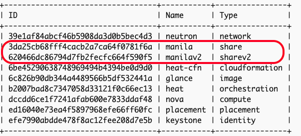
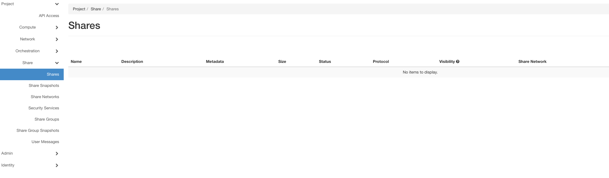

# Chapter 05
## OpenStack Storage – Block, Object, and File Shares

## Description

The Chapter extends and uses the deployment of a multi-node OpenStack environment as described in [Chapter03](https://github.com/PacktPublishing/Mastering-OpenStack-Third-Edition/tree/main/Chapter03):
- Add a Storage Node
- Configure Cinder Volume as storage backend
- Configure NFS as storage backend
- Configure Ceph as storage backend
- Enable OpenStack Manila for file sharing service
- Enable Swift for object storage service


### System and Software Specs:

The following hardware specifications are used for the  Storage Node:

| Hostname |vCPUs| RAM | Disk Space | Network Interfaces| Role 
|------|----|---------------|-------------|--------|--------|
| `storage01.os` |`4`| `32GB` | `1TB` | `4 x 10GB` | Storage Node|  


Optionally, for multiple storge backends support, it is recommended to use dedicated storage node(s). 
The following hardware specifications are used for a second Storage Node:
| Hostname |vCPUs| RAM | Disk Space | Network Interfaces| Role 
|------|----|---------------|-------------|--------|--------|
| `storage02.os` |`4`| `32GB` | `500GB` | `4 x 10GB` | Storage Node|  

> [!NOTE]
> The mentioned resources are being used in large production environments. Feel free to adjust the specs based on available resources you have but staying with minimum requirements to avoid performance issues. 

The chapter uses the different tools and software versions:

- **Operating System**: Ubuntu 22.04 LTS
- **kolla-ansible**: Latest and stable version from OpenStack Git master branch  (_Description in next section_)
- **Python**: Version 3.X.X
- **Ansible Core**: Any version between ```2.16```  and ```2.17.99```.
- **Jenkins**: Any version for the latest Ubuntu/Debian Jenkins repository (_Description in next section_)


### Code - How-To:

The Chapter uses the kolla-ansible community [repostority](https://github.com/openstack/kolla-ansible).

Make sure you followed instructions to setup Jenkins and CI/CD pipeline for kolla-ansible deployment in [Chapter02](https://github.com/PacktPublishing/Mastering-OpenStack-Third-Edition/tree/main/Chapter02#3setting-up-the-cicd-pipeline)

Required files are:
- ```ansible/inventory/multi_packtpub_prod``` : Inventory file for multi-node setup
- ```/etc/kolla/globals.yaml``` : OpenStack configurations and parameters 

You can check the branch naming standard used by the OpenStack community in the Github page by clicking on the Switch branches/tags button the top right of the page:


Branches with **stable/** prefix are still maintained. Non maintained OpenStack releases are named with branches with **unmaintained/** prefix. 


## Deployment of Multi-Node OpenStack environment:
### Example Production Topology: 

1. The following topology is being deployed in Multi-Node OpenStack setup:

```
 
```


2. Storage Node IP Allocation:

| Hostname |Role| Network Interface | Network Attachement | IP Address|  
|------|----|---------------|-------------|--------|
| `storage01.os.packtpub` |`Storage Node`| `eth0` | `Management` | `10.0.0.35` | 
|            |             | `eth1` | `Overlay/Tenant` | `10.10.0.35` | 
|            |             | `eth2` | `External` | `10.20.0.35` | 
|            |             | `eth3` | `Storage` | `10.30.0.35` |  
| `storage02.os.packtpub` |`Storage Node`| `eth0` | `Management` | `10.0.0.36` | 
|            |             | `eth1` | `Overlay/Tenant` | `10.10.0.36` | 
|            |             | `eth2` | `External` | `10.20.0.36` | 
|            |             | `eth3` | `Storage` | `10.30.0.36` |  


### Deployment prepartion:

1. Update optionally on the Deployer node the hosts file with respective DNS entries of the additional Storage node:

```sh
tee -a /etc/hosts<<EOF
### SECOND STORAGE NODE
10.0.0.36 storage02.os
EOF
```

2. Setup SSH keys so that the Deployer node can SSH password-less login to the additional Compute node:

```sh
ssh-copy-id -o StrictHostKeyChecking=no ~/.ssh/id_rsa.pub root@storage02.os ; 
```

> [!NOTE]
> You can copy manually the generared `id_rsa.pub` file from the Deployer host to the OpenStack nodes located under `.ssh/authorized_keys`


3. Configure the hostnames and timezone for additional Compute node:

```sh
  ssh root@storage02.os hostnamectl set-hostname storage02.os
  ssh root@storage02.os timedatectl set-timezone Europe/Amsterdam
```

4. Run an update and upgarde of the Ubuntu packages index  in the additional Compute node:

```sh
apt-get update -y; apt-get upgrade -y
```

5. Install Docker engine in the additional Compute node:
 ```sh
sudo apt-get install docker-ce docker-ce-cli containerd.io
```

### Deployment Configuration:
#### Assumptions:
-  Jenkins installed and running in the Deployer Node as explored in [Chapter02](https://github.com/PacktPublishing/Mastering-OpenStack-Third-Edition/blob/main/Chapter02/README.md#3setting-up-the-cicd-pipeline)
-  A local Docker registry is created as described in [Chapter02](https://github.com/PacktPublishing/Mastering-OpenStack-Third-Edition/blob/main/Chapter02/README.md#2-prepare-the-deployment-environment)
- Available block devices for LVM in target storage nodes `/dev/sdb` 


1. Copy the `/ansible/inventory/multi_packtpub` inventory file provided [here](https://github.com/PacktPublishing/Mastering-OpenStack-Third-Edition/blob/main/Chapter03/ansible/inventory/multi_packtpub_prod) that includes the additional Compute node:

```sh
...
...

## Compute Node 
[storage]
storage01.os.packtpub
storage02.os.packtpub

[deployment]
localhost       ansible_connection=local
...
```

### LVM Backend Deployment:
#### Assumptions:
- Available block storage device on storage node(s) - /dev/sdb

1. Create a new LVM phsysical volume group on the storage node(s):

```sh
pvcreate /dev/sdb
```

2. Create a new volume group named `cinder-volumes`:

```sh
vgcreate –f cinder-volumes /dev/sdb
```

3. Copy/edit the configuration defined in `globals.yaml` file can be found [here](https://github.com/PacktPublishing/Mastering-OpenStack-Third-Edition/blob/main/Chapter05/etc/kolla/globals.yml).  The additional configuration includes the following settings:

```sh
enable_cinder_backend_lvm: "yes"
cinder_volume_group: "cinder-volumes"
```

4. Run the deployment using the  Jenkins Pipeline as described in [Chapter03](https://github.com/PacktPublishing/Mastering-OpenStack-Third-Edition/blob/main/Chapter03/README.md#deployment-configuration). The Pipeline uses the stages provided [here](https://github.com/PacktPublishing/Mastering-OpenStack-Third-Edition/blob/main/Chapter03/Jenkinsfile):

```sh
..
PLAY RECAP ***************************************************************************************************************************************************
...
storage02.os.packtpub             : ok=15   changed=0    unreachable=0    failed=0    skipped=55   rescued=0    ignored=0   
localhost                         : ok=28   changed=0    unreachable=0    failed=0    skipped=81   rescued=0    ignored=0   
... 
```

### NFS Backend Deployment:
#### Assumptions:
- NFS server exists with a file share path `nfs-host-pp:/nfs/share/cinder`. To create an NFS server on target storage, use the following [guide](https://ubuntu.com/server/docs/network-file-system-nfs).

1. Create a file share in the target storage node:
```sh
echo "nfs-host-pp:/nfs/share/cinder" > /etc/cinder/nfs_share
```

2. Install NFS client:
```sh
apt-get install nfs-common
```

3. Configure the volumes to be mounted in `/etc/exports` in the storage NFS backend:
```sh
/nfs/share/cinder 10.30.0.0/24(rw,sync,no_root_squash)
```

4. Copy the content of NFS shares entries for each storage node that can be found [here](https://github.com/PacktPublishing/Mastering-OpenStack-Third-Edition/blob/main/Chapter05/etc/kolla/config/nfs_shares):

```sh
storage01.os:/nfs/share/cinder
storage02.os:/nfs/share/cinder
```

5. Copy/edit the configuration defined in `globals.yaml` file can be found [here](https://github.com/PacktPublishing/Mastering-OpenStack-Third-Edition/blob/main/Chapter05/etc/kolla/globals.yml).  The additional configuration includes the following settings:

```sh
...
enable_cinder_backend_nfs: "yes"
...
```

6. Run the deployment using the  Jenkins Pipeline as described in [Chapter03](https://github.com/PacktPublishing/Mastering-OpenStack-Third-Edition/blob/main/Chapter03/README.md#deployment-configuration). The Pipeline uses the stages provided [here](https://github.com/PacktPublishing/Mastering-OpenStack-Third-Edition/blob/main/Chapter03/Jenkinsfile).

7. Check on storage node the NFS share directory:
```sh
mount | grep nfs
```

<details close>
  <summary>Output</summary>

```sh
nfs-host-pp:/nfs/share/cinder on /etc/cinder/nfs_share
223af296419e436d9142928374d8e57e 
type nfs4 (rw,relatime,vers=4.1,rsize=81921,wsize=81921,namlen=255,hard,proto=tcp,port=0,clientaddr=10.30.255.1,local_lock=none,addr=10.30.255.1)
```

</details>


### Ceph Backend Deployment:
#### Assumptions:
-
-


1. Install Ceph client in each controller, compute and storage node:
```sh
 apt-get install ceph-common python-rbd
```

2. On each storage node, create a Ceph OSD storage pool:
```sh
 ceph osd pool create cinder-volumes 256
```

3. Initialize the created OSD storage pool:
```sh
rbd pool init cinder-volumes
```

4. Create Ceph user/keyring to access the created Ceph pool:
```sh
ceph auth get-or-create client.cinder mon 'profile rbd' osd 'profile rbd pool=cinder-volumes' mgr 'profile rbd pool=volumes' > ceph.client.cinder.keyring
```

5. Copy the generated keyring to the Deployer, compute and storage nodes:
```sh
ceph auth get-or-create client.cinder | ssh storage01.os sudo tee /etc/kolla/config/cinder/cinder-volume/ceph.client.cinder.keyring
ceph auth get-or-create client.cinder | ssh cc01.os sudo tee /etc/ceph/ceph.client.cinder.keyring
ceph auth get-or-create client.cinder | ssh cn01.os sudo tee /etc/ceph/ceph.client.cinder.keyring
```

6. Grab the `Cinder RBD Secret UUID` generated in the `/etc/kolla/passwords` file for later configuration:
```sh
cat /etc/kolla/passwords.yml |grep cinder_rbd_secret_uuid 
```

7. Create and copy the content of `/etc/kolla/config/cinder/cinder-volume.conf` file provided [here](https://github.com/PacktPublishing/Mastering-OpenStack-Third-Edition/blob/main/Chapter05/etc/kolla/config/cinder/ceph.conf). Make sure to adjust the settings based on your environment:
```sh
# Name of the Ceph RBD Backend
enabled_backends
# RBD user
rbd_user
# RBD Pool created in step 2
rbd_pool
# Name of assigned volume RBD backend 
volume_backend_name
# Cinder UUID secret generated in step 6
rbd_secret_uuid
# Ceph Monitor Host IP from a Ceph node
mon_host
# Assigned Ceph IP Pool
cluster_network
```

8. Create and copy the content of `/etc/kolla/globals.yaml` file provided [here](https://github.com/PacktPublishing/Mastering-OpenStack-Third-Edition/blob/main/Chapter03/etc/kolla/globals.yml). In this chapter the additional settings to deploy `Manila` service in the `/etc/kolla/globals.yaml` file are used:

```sh
....
###################
# OpenStack options
###################
...
cinder_backend_ceph: "yes"
ceph_cinder_keyring: "ceph.client.cinder.keyring"
ceph_cinder_user: "cinder"
ceph_cinder_pool_name: "cinder-volumes"
...
```

9. Run the deployment using the  Jenkins Pipeline as described in [Chapter03](https://github.com/PacktPublishing/Mastering-OpenStack-Third-Edition/blob/main/Chapter03/README.md#deployment-configuration). The Pipeline uses the stages provided [here](https://github.com/PacktPublishing/Mastering-OpenStack-Third-Edition/blob/main/Chapter03/Jenkinsfile)

### Enable File Sharing Service - Manila

#### Assumptions:
-  Jenkins installed and running in the Deployer Node as explored in [Chapter02](https://github.com/PacktPublishing/Mastering-OpenStack-Third-Edition/blob/main/Chapter02/README.md#3setting-up-the-cicd-pipeline)
-  A local Docker registry is created as described in [Chapter02](https://github.com/PacktPublishing/Mastering-OpenStack-Third-Edition/blob/main/Chapter02/README.md#2-prepare-the-deployment-environment)

1. Create and copy the content of `/etc/kolla/globals.yaml` file provided [here](https://github.com/PacktPublishing/Mastering-OpenStack-Third-Edition/blob/main/Chapter03/etc/kolla/globals.yml). In this chapter the additional settings to deploy `Manila` service in the `/etc/kolla/globals.yaml` file are used:

```sh
....
###################
# OpenStack options
###################
...
enable_manila : "yes"
enable_manila_backend_generic: "yes"
...
```

2. Add the corresponding `manila` services in `/ansible/inventory/multi_packtpub` inventory file if not assigned yet. `Manila` `API`, `Scheduler` and `Data` services will be running on the `Cloud Controller` node. `Manila` `Share` will be running on the Network node. The updated inventory file can be found [here](https://github.com/PacktPublishing/Mastering-OpenStack-Third-Edition/blob/main/Chapter04/ansible/inventory/multi_packtpub_prod):

```sh
...
[manila:children]
control
[manila-api:children]
manila
[manila-scheduler:children]
manila
[manila-data:children]
manila
[manila-share:children]
network
...
```


3.  Run the deployment using the  Jenkins Pipeline as described in [Chapter03](https://github.com/PacktPublishing/Mastering-OpenStack-Third-Edition/blob/main/Chapter03/README.md#deployment-configuration). The Pipeline uses the stages provided [here](https://github.com/PacktPublishing/Mastering-OpenStack-Third-Edition/blob/main/Chapter03/Jenkinsfile):

```sh
...
TASK [manila : Creating Manila database]**********************************************************************
...

TASK [manila : Creating Manila database user and setting permissions] ****************************************
...
TASK [manila : Running Manila bootstrap container]************************************************************
...
```

4. After the deployment is finished, check the new Magnum containers:

```sh
docker ps -a 
```

<details close>
  <summary>Output</summary>

  ```sh
CONTAINER ID     IMAGE                                                     COMMAND                     CREATED           STATUS                            PORTS     NAMES
f8324966bf80     registry/openstack.kolla/manila-scheduler:master-rocky-9  "dumb-init--single-.."      18 seconds ago    Up 5 seconds (health: starting)             manila_scheduler
a0c4b325fb33     registry/openstack.kolla/manila-data:master-rocky-9       "dumb-init--single-.."      25 seconds ago    Up 21 seconds (health: starting)            manila_data
98d3cedad03a     registry/openstack.kolla/manila-api:master-rocky-9        "dumb-init--single-.."      24 seconds ago    Up 41 seconds (health: starting)            manila_api
59a0b5c8f5c8     registry/openstack.kolla/manila-share:master-rocky-9        "dumb-init--single-.."    15 seconds ago    Up 7 seconds (health: starting)            manila_share
...

```
</details>


5. Once Manila containers are up and running, verify the service endpoint is created:

```sh
openstack service list
```
<details close>
  <summary>Output</summary>

 
</details>


6. Optionally, login to the Horizon dashboard in the respective OpenStack Project. The `Manila` tab should be visible to operate file sharing from the dashboard:




### Enable Object Storage Service - Swift

#### Assumptions:
-  Jenkins installed and running in the Deployer Node as explored in [Chapter02](https://github.com/PacktPublishing/Mastering-OpenStack-Third-Edition/blob/main/Chapter02/README.md#3setting-up-the-cicd-pipeline)
-  A local Docker registry is created as described in [Chapter02](https://github.com/PacktPublishing/Mastering-OpenStack-Third-Edition/blob/main/Chapter02/README.md#2-prepare-the-deployment-environment)

1. Create and copy the content of `/etc/kolla/globals.yaml` file provided [here](https://github.com/PacktPublishing/Mastering-OpenStack-Third-Edition/blob/main/Chapter03/etc/kolla/globals.yml). In this chapter the additional settings to deploy `Swift` service in the `/etc/kolla/globals.yaml` file are used:

```sh
....
###################
# OpenStack options
###################
...

...
```

2. Add the corresponding `Swift` services in `/ansible/inventory/multi_packtpub` inventory file if not assigned yet. `Zun` `API` and `Proxy` services will be running on the `Cloud Controller` node. `Zun` `Compute` and `CNI` services will be running on the `Compute` node(s).  The updated inventory file can be found [here](https://github.com/PacktPublishing/Mastering-OpenStack-Third-Edition/blob/main/Chapter04/ansible/inventory/multi_packtpub_prod):

```sh
...


```


3.  Run the deployment using the  Jenkins Pipeline as described in [Chapter03](https://github.com/PacktPublishing/Mastering-OpenStack-Third-Edition/blob/main/Chapter03/README.md#deployment-configuration). The Pipeline uses the stages provided [here](https://github.com/PacktPublishing/Mastering-OpenStack-Third-Edition/blob/main/Chapter03/Jenkinsfile):

```sh
...
TASK [swift : Creating Swift database]**********************************************************************
...

TASK [swift : Creating Swift database user and setting permissions] ****************************************
...
TASK [swift : Running Swift bootstrap container]************************************************************
...
```

4. After the deployment is finished, check the new Zun containers:

```sh
docker ps -a 
```

<details close>
  <summary>Output</summary>

  ```sh
CONTAINER ID     IMAGE                                                     COMMAND                     CREATED            STATUS                            PORTS     NAMES
f0463f325397     registry/openstack.kolla/zun-cni-daemon:master-rocky-9    "dumb-init--single-.."      43 minutes ago     Up 43 minutes ago (healthy)                 zun_cni_daemon
124f176ed43f     registry/openstack.kolla/zun-compute:master-rocky-9       "dumb-init--single-.."      43 minutes ago     Up 43 minutes ago (healthy)                 zun_compute
2d5e5327c47e     registry/openstack.kolla/zun-wsproxy:master-rocky-9       "dumb-init--single-.."      44 minutes ago     Up 44 minutes ago (healthy)                 zun_wsproxy
eed76d69d426     registry/openstack.kolla/zun-api:master-rocky-9           "dumb-init--single-.."      44 minutes ago     UP 44 minutes ago (healthy)                 zun_api
...

```
</details>


5. Once Zun containers are up and running, verify the service endpoint is created:

```sh
openstack service list
```
<details close>
  <summary>Output</summary>

 

</details>


