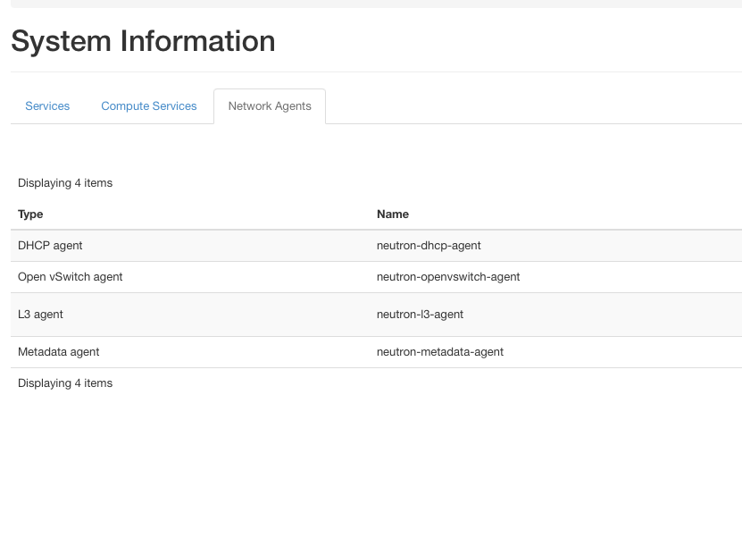

# Chapter 06
## OpenStack Networking – Connectivity and Managed Service Options

## Description

The Chapter extends and uses the deployment of a multi-node OpenStack environment as described in [Chapter03](https://github.com/PacktPublishing/Mastering-OpenStack-Third-Edition/tree/main/Chapter03):
- Configure OpenStack networking using OpenvSwitch (OVS) mechansim.
- Configure OpenStack networking using Open Virtual Network (OVN) mechansim.
- Configure OpenStack networking for dynamic routing.
- Enable Neutron Load Balancer as Service (LBaaS) plugin.


### System and Software Specs:

The chapter uses the same hardware and configuration for multi-node OpenStack setup as deployed in [Chapter03](https://github.com/PacktPublishing/Mastering-OpenStack-Third-Edition/tree/main/Chapter03):

| Hostname |vCPUs| RAM | Disk Space | Network Interfaces| Role 
|------|----|---------------|-------------|--------|--------|
| `cc01.os` |`8`| `128GB` | `250GB` | `4 x 10GB` | Cloud Controller| 
| `cn01.os` |`12`| `240GB` | `500GB` | `4 x 10GB` | Compute Node|  
| `net01.os` |`4`| `32GB` | `250GB` |`4 x 10GB` | Network Node| 
| `storage01.os` |`4`| `32GB` | `1TB` |`4 x 10GB` | Storage Node| 

> [!NOTE]
> The mentioned resources are being used in large production environments. Feel free to adjust the specs based on available resources you have but staying with minimum requirements to avoid performance issues. 


The chapter uses the different tools and software versions:

- **Operating System**: Ubuntu 22.04 LTS
- **kolla-ansible**: Latest and stable version from OpenStack Git master branch  (_Description in next section_)
- **Python**: Version 3.X.X
- **Ansible Core**: Any version between ```2.16```  and ```2.17.99```.
- **Jenkins**: Any version for the latest Ubuntu/Debian Jenkins repository (_Description in next section_)


### Code - How-To:

The Chapter uses the kolla-ansible community [repostority](https://github.com/openstack/kolla-ansible).

Make sure you followed instructions to setup Jenkins and CI/CD pipeline for kolla-ansible deployment in [Chapter02](https://github.com/PacktPublishing/Mastering-OpenStack-Third-Edition/tree/main/Chapter02#3setting-up-the-cicd-pipeline)

Required files are:
- ```ansible/inventory/multi_packtpub_prod``` : Inventory file for multi-node setup
- ```/etc/kolla/globals.yaml``` : OpenStack configurations and parameters 

You can check the branch naming standard used by the OpenStack community in the Github page by clicking on the Switch branches/tags button the top right of the page:


Branches with **stable/** prefix are still maintained. Non maintained OpenStack releases are named with branches with **unmaintained/** prefix. 


## Deployment of Multi-Node OpenStack environment:
### Example Production Topology: 

1. The following topology is being deployed in Multi-Node OpenStack setup:

```
 
```


2. Hosts IP Allocation:

| Hostname |Role| Network Interface | Network Attachement | IP Address|  
|------|----|---------------|-------------|--------|
| `deployer.os.packtpub` |`Deployer`| `eth0` | `Management` | `10.0.0.15` | 
|            |             | `eth1` | `External` | `10.20.0.15` | 
| `cc01.os.packtpub` |`Cloud Controller`| `eth0` | `Management` | `10.0.0.100` | 
|            |             | `eth1` | `Overlay/Tenant` | `10.10.0.100` | 
|            |             | `eth2` | `External` | `10.20.0.100` | 
|            |             | `eth3` | `Storage` | `10.30.0.100` | 
| `cn01.os.packtpub` |`Compute Node`| `eth0` | `Management` | `10.0.0.25` | 
|            |             | `eth1` | `Overlay/Tenant` | `10.10.0.25` | 
|            |             | `eth2` | `External` | `10.20.0.25` | 
|            |             | `eth3` | `Storage` | `10.30.0.25` |  
| `net01.os.packtpub` |`Network Node`| `eth0` | `Management` |`10.0.0.30` |
|            |             | `eth1` | `Overlay/Tenant` | `10.10.0.30` | 
|            |             | `eth2` | `External` | `10.20.0.30` | 
|            |             | `eth3` | `Storage` | `10.30.0.30` | 
| `storage01.os.packtpub` |`Storage Node`| `eth0` | `Management` |`10.0.0.35` | 
|            |             | `eth1` | `Overlay/Tenant` | `10.10.0.35` | 
|            |             | `eth2` | `External` | `10.20.0.35` | 
|            |             | `eth3` | `Storage` | `10.20.0.35` | 


### Deployment Configuration:
#### Assumptions:
-  Jenkins installed and running in the Deployer Node as explored in [Chapter02](https://github.com/PacktPublishing/Mastering-OpenStack-Third-Edition/blob/main/Chapter02/README.md#3setting-up-the-cicd-pipeline)
-  A local Docker registry is created as described in [Chapter02](https://github.com/PacktPublishing/Mastering-OpenStack-Third-Edition/blob/main/Chapter02/README.md#2-prepare-the-deployment-environment)


#### OVS Deployment:

1. Copy/edit the configuration defined in `globals.yaml` file can be found [here](https://github.com/PacktPublishing/Mastering-OpenStack-Third-Edition/blob/main/Chapter06/etc/kolla/globals.yml).  The additional configuration includes the association of the external network interface `eth2` designated interface as described in [Chapter03](https://github.com/PacktPublishing/Mastering-OpenStack-Third-Edition/tree/main/Chapter03):

```sh
...
neutron_external_interface: "eth2"
...
```

2. Make sure to enable the Neutron plugin agent to use OpenvSwitch plugin:

```sh
...
neutron_plugin_agent: "openvswitch"
...
```

3. Most of the OpenStack roles have been assigned in the `multi_packtpub_prod` inventory file. Make sure to have the following settings in the inventory file if not configured yet in previous chapters:

```sh
[control]
cc01.os.packtpub
...
[neutron-server:children]
control
...
...
[network]
net01.os.packtpub
[neutron:children]
network
[neutron-dhcp-agent:children]
neutron
[neutron-l3-agent:children]
neutron
[neutron-metadata-agent:children]
neutron
...
...
[openvswitch:children]
network
compute
manila-share
...

```

4. Run the deployment using the  Jenkins Pipeline as described in [Chapter03](https://github.com/PacktPublishing/Mastering-OpenStack-Third-Edition/blob/main/Chapter03/README.md#deployment-configuration). The Pipeline uses the stages provided [here](https://github.com/PacktPublishing/Mastering-OpenStack-Third-Edition/blob/main/Chapter03/Jenkinsfile):

```sh
..
PLAY RECAP ***************************************************************************************************************************************************
...
localhost                         : ok=21   changed=0    unreachable=0    failed=0    skipped=97   rescued=0    ignored=0   
... 
```

5. Login to the OpenStack `Dashboard` --> `System Information` and click on `Network Agents` tab. That should list installed Neutron agents including OVS agent:




#### OVN Deployment:

1. Copy/edit the configuration defined in `globals.yaml` file can be found [here](https://github.com/PacktPublishing/Mastering-OpenStack-Third-Edition/blob/main/Chapter06/etc/kolla/globals.yml).  The additional configuration includes the association of the external network interface `eth2` designated interface as described in [Chapter03](https://github.com/PacktPublishing/Mastering-OpenStack-Third-Edition/tree/main/Chapter03):

```sh
...
neutron_external_interface: "eth2"
...
```

2. Make sure to enable the Neutron plugin agent to use Open Virtual Network plugin:

```sh
...
neutron_plugin_agent: "ovn"
...
```

3. Enable OVN agent for additional network capabilities:

```sh
...
neutron_enable_ovn_agent: "yes"
...
```

4. Enable distributed floating IP OVN feature:
```sh
...
neutron_ovn_distributed_fip: "yes"
...
```

5. Most of the OpenStack roles have been assigned in the `multi_packtpub_prod` inventory file. Make sure to have the following settings in the inventory file if not configured yet in previous chapters for OVN: 

```sh
[control]
cc01.os.packtpub
...
[neutron-server:children]
control
...
...
[network]
net01.os.packtpub
[neutron:children]
network
[neutron-dhcp-agent:children]
neutron
[neutron-l3-agent:children]
neutron
[neutron-metadata-agent:children]
neutron
...
...
...
[ovn-database:children]
control
[ovn-northd:children]
ovn-database
[ovn-nb-db:children]
ovn-database
[ovn-sb-db:children]
ovn-database
...
[neutron-ovn-agent:children]
compute
[ovn-controller:children]
ovn-controller-compute
[ovn-controller-compute:children]
compute
[neutron-ovn-metadata-agent:children]
compute
...

```

6. Run the deployment using the  Jenkins Pipeline as described in [Chapter03](https://github.com/PacktPublishing/Mastering-OpenStack-Third-Edition/blob/main/Chapter03/README.md#deployment-configuration). The Pipeline uses the stages provided [here](https://github.com/PacktPublishing/Mastering-OpenStack-Third-Edition/blob/main/Chapter03/Jenkinsfile):

```sh
..
PLAY RECAP ***************************************************************************************************************************************************
...
localhost                         : ok=20   changed=0    unreachable=0    failed=0    skipped=76   rescued=0    ignored=0   
... 
```


#### Neutron Dyanmic Routing:

1. Copy/edit the configuration defined in `globals.yaml` file can be found [here](https://github.com/PacktPublishing/Mastering-OpenStack-Third-Edition/blob/main/Chapter06/etc/kolla/globals.yml).  The additional configuration includes the enablement of BPG agent as follows:

```sh
...
enable_neutron_bgp_dragent: "yes"
...
```


2. Most of the OpenStack roles have been assigned in the `multi_packtpub_prod` inventory file. Add the BGP agent role to run on the network node:


```sh
...
[neutron-bgp-dragent:children]
neutron
...
```

3. Run the deployment using the  Jenkins Pipeline as described in [Chapter03](https://github.com/PacktPublishing/Mastering-OpenStack-Third-Edition/blob/main/Chapter03/README.md#deployment-configuration). The Pipeline uses the stages provided [here](https://github.com/PacktPublishing/Mastering-OpenStack-Third-Edition/blob/main/Chapter03/Jenkinsfile):

```sh
..
PLAY RECAP ***************************************************************************************************************************************************
...
localhost                         : ok=9   changed=0    unreachable=0    failed=0    skipped=87   rescued=0    ignored=0   
... 
```


4. Source the admin credentials file and check the additonal BGP agent plugin using CLI:

```sh
source /etc/kolla/admin-openrc.sh
openstack network agent --list --agent-type bgp
```

<details close>
  <summary>Output</summary>

 
</details>


#### Enable Load Balancer as a Service - Octavia 


1. Create and copy the content of `/etc/kolla/globals.yaml` file provided [here](https://github.com/PacktPublishing/Mastering-OpenStack-Third-Edition/blob/main/Chapter06/etc/kolla/globals.yml). In this chapter the additional settings to deploy `Octavia` service in the `/etc/kolla/globals.yaml` file are used:

```sh
....
###################
# OpenStack options
###################
...
enable_octavia: "yes"
octavia_network_interface: eth0
octavia_auto_configure: "yes
...
```

2. Add the corresponding `octavia` services in `/ansible/inventory/multi_packtpub` inventory file if not assigned yet. `Octavia` `API`, `Driver Agents`, `Health Manager`, `Housekeeing` and  `Worker` services will be running on the `Cloud Controller` node. The updated inventory file can be found [here](https://github.com/PacktPublishing/Mastering-OpenStack-Third-Edition/blob/main/Chapter04/ansible/inventory/multi_packtpub_prod):

```sh
...
[octavia:children]
control
[octavia-api:children]
octavia
[octavia-driver-agent:children]
octavia
[octavia-health-manager:children]
octavia
[octavia-housekeeping:children]
octavia
[octavia-worker:children]
octavia
...
```


3.  Run the deployment using the  Jenkins Pipeline as described in [Chapter03](https://github.com/PacktPublishing/Mastering-OpenStack-Third-Edition/blob/main/Chapter03/README.md#deployment-configuration). The Pipeline uses the stages provided [here](https://github.com/PacktPublishing/Mastering-OpenStack-Third-Edition/blob/main/Chapter03/Jenkinsfile):

```sh
...
TASK [octavia : Creating Octavia database]**********************************************************************
...

TASK [octavia : Creating Octavia database user and setting permissions] ****************************************
...
TASK [octavia : Running Octavia bootstrap container]************************************************************
...
```

4. Generate Octavia startup file:

```sh
kolla-ansible post-deploy
. /etc/kolla/octavia-openrc.sh
```


