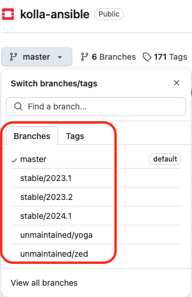
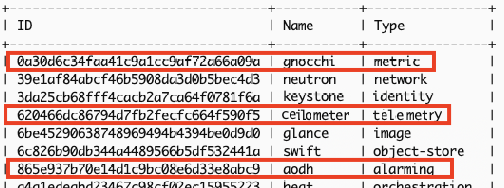

# Chapter 8
## Monitoring and Logging – Remediate Proactively

## Description

The Chapter extends and uses the deployment of a multi-node OpenStack environment as described in [Chapter03](https://github.com/PacktPublishing/Mastering-OpenStack-Third-Edition/tree/main/Chapter03):
- Add OpenStack Monitoring host
- Deploy and configure Prometheus  
- Deploy and configure Grafana  
- Deploy Ceilometer, Aodh and Gnochi
- Deploy and configure OpenSearch


<details close>
  <summary>Output</summary>

  ```sh

```

</details>


### System and Software Specs:

The chapter uses the same hardware and configuration for multi-node OpenStack setup as deployed in [Chapter03](https://github.com/PacktPublishing/Mastering-OpenStack-Third-Edition/tree/main/Chapter03) and [Chapter07](https://github.com/PacktPublishing/Mastering-OpenStack-Third-Edition/tree/main/Chapter07). The additional mnonitoring host in this chapter has the following hardware specifications:


| Hostname |vCPUs| RAM | Disk Space | Network Interfaces| Role 
|------|----|---------------|-------------|--------|--------|
| `mon01.os` |`8`| `32GB` | `500GB` | `4 x 10GB` | Monitoring Node| 

> [!NOTE]
> The mentioned resources are being used in large production environments. Feel free to adjust the specs based on available resources you have but staying with minimum requirements to avoid performance issues. 


The chapter uses the different tools and software versions:

- **Operating System**: Ubuntu 22.04 LTS
- **kolla-ansible**: Latest and stable version from OpenStack Git master branch  (_Description in next section_)
- **Python**: Version 3.X.X
- **Ansible Core**: Any version between ```2.16```  and ```2.17.99```.
- **Jenkins**: Any version for the latest Ubuntu/Debian Jenkins repository (_Description in next section_)


### Code - How-To:

The Chapter uses the kolla-ansible community [repostority](https://github.com/openstack/kolla-ansible).

Make sure you followed instructions to setup Jenkins and CI/CD pipeline for kolla-ansible deployment in [Chapter02](https://github.com/PacktPublishing/Mastering-OpenStack-Third-Edition/tree/main/Chapter02#3setting-up-the-cicd-pipeline)

Required files for Chapter03 are:
- ```ansible/inventory/multi_packtpub_prod``` : Inventory file for multi-node setup
- ```/etc/kolla/globals.yaml``` : OpenStack configurations and parameters 

You can check the branch naming standard used by the OpenStack community in the Github page by clicking on the Switch branches/tags button the top right of the page:



Branches with **stable/** prefix are still maintained. Non maintained OpenStack releases are named with branches with **unmaintained/** prefix. 


## Deployment of the environment:

1. Hosts IP Allocation:

| Hostname |Role| Network Interface | Network Attachement | IP Address|  
|------|----|---------------|-------------|--------|
| `mon01.os.packtpub` |`Monitoring Host`| `eth0` | `Management` | `10.0.0.120` | 
|            |             | `eth1` | `Overlay/Tenant` | `10.10.0.120` | 
|            |             | `eth2` | `External` | `10.20.0.120` | 
|            |             | `eth3` | `Storage` | `10.30.0.120` | 

### Deployment prepartion:

1. Update optionally on the Deployer node the hosts file with respective DNS entries of the additional Storage node:

```sh
tee -a /etc/hosts<<EOF
### MONITORING NODE
10.0.0.120 mon01.os
EOF
```

2. Setup SSH keys so that the Deployer node can SSH password-less login to the additional Compute node:

```sh
ssh-copy-id -o StrictHostKeyChecking=no ~/.ssh/id_rsa.pub root@mon01.os ; 
```

> [!NOTE]
> You can copy manually the generared `id_rsa.pub` file from the Deployer host to the OpenStack nodes located under `.ssh/authorized_keys`


3. Configure the hostnames and timezone for additional Compute node:

```sh
  ssh root@mon01.os hostnamectl set-hostname mon01.os
  ssh root@mon01.os timedatectl set-timezone Europe/Amsterdam
```

4. Run an update and upgarde of the Ubuntu packages index  in the additional Monitoring node:

```sh
apt-get update -y; apt-get upgrade -y
```

5. Install Docker engine in the additional Monitoring node:
 ```sh
sudo apt-get install docker-ce docker-ce-cli containerd.io
```


### Deployment and Configuration of Prometheus and Grafana
#### Assumptions:
-  Jenkins installed and running in the Deployer Node as explored in [Chapter02](https://github.com/PacktPublishing/Mastering-OpenStack-Third-Edition/blob/main/Chapter02/README.md#3setting-up-the-cicd-pipeline)
-  A local Docker registry is created as described in [Chapter02](https://github.com/PacktPublishing/Mastering-OpenStack-Third-Edition/blob/main/Chapter02/README.md#2-prepare-the-deployment-environment)


1. Copy the `/ansible/inventory/multi_packtpub_prod` inventory file provided [here](https://github.com/PacktPublishing/Mastering-OpenStack-Third-Edition/blob/main/Chapter08/ansible/inventory/multi_packtpub_prod) that includes the additional Monitoring node and assigned roles (`Prometheus`, `Promtheus Alert Manager`, `OpenStack Exporter` and `Grafana`). For all OpenStack nodes, assign the `Prometheus Node Exporter` and `Prometheus cAdvisor`. Assign the `Prometheus MySQL exporter` to the host running `MariaDB`, `Prometheus HAProxy exporter` to the hosts assigned with `Load Balancer` role, and `Prometheus Libvirt exporter` to hosts running the OpenStack `Compute` service:

```sh
...
## Monitoring Node 
[monitoring]
mon01.os.packtpub

[deployment]
localhost       ansible_connection=local
...

[prometheus:children]
monitoring
...
[grafana:children]
monitoring
...
[prometheus-alertmanager:children]
monitoring
...
[prometheus-openstack-exporter:children]
monitoring
...
[prometheus-node-exporter:children]
monitoring
control
compute
network
storage
...
[prometheus-mysqld-exporter:children]
mariadb
...
[prometheus-haproxy-exporter:children]
loadbalancer
...
[prometheus-libvirt-exporter:children]
compute
...
[prometheus-cadvisor:children]
monitoring
control
compute
network
storage
...

```

2. Create/Edit the content of `/etc/kolla/globals.yaml` file provided [here](https://github.com/PacktPublishing/Mastering-OpenStack-Third-Edition/blob/main/Chapter08/etc/kolla/globals.yml). In this chapter the following settings in the `/etc/kolla/globals.yaml` file are used:

```sh
###################
# Ansible options
###################
kolla_base_distro: "ubuntu"
openstack_release: "master"
kolla_internal_vip_address: "10.0.0.47"
kolla_external_vip_address: "{{ kolla_internal_vip_address }}"
########################
# Nova - Compute Options
########################
nova_compute_virt_type: "kvm"
##############################
# Neutron - Networking Options
##############################
network_interface: "eth0"
neutron_external_interface: "eth2"
neutron_plugin_agent: "openvswitch"
###################
# OpenStack options
###################
enable_neutron_provider_networks: "yes"
enable_cinder_backend_lvm: "yes"
cinder_volume_group: "cinder-volumes"
enable_haproxy: "yes"
enable_prometheus: "yes"
enable_grafana: "yes"
prometheus_cmdline_extras: " --web.max-connections 30 --log.level error --rules.alert.resend-delay 30s --storage.tsdb.retention.time 30d "  
################
# Docker options
################
docker_registry: 10.0.0.15:4000
docker_registry_insecure: "yes"
```

3. Run the Jenkins Pipeline and make sure the new Monitoring node is properly installed:

```sh
..
PLAY RECAP *************************************************************************************************************************************************** 
...
localhost                          : ok=22   changed=0    unreachable=0    failed=0    skipped=19   rescued=0    ignored=0   
...
mon01.os.packtpub                  : ok=33   changed=0    unreachable=0    failed=0    skipped=88   rescued=0    ignored=0 
...
```

> [!IMPORTANT]
> Make sure to commit and push Jenkins pipelines files to your repository with the respective branch.
> e.g: `Jenkinsfile` in this chapter is pushed to a branch named `production` as it targets different environment and not the same as described in `Chapter02`. 


4. After the deployment is finished, check the new containers for Prometheus and Grafana :

```sh
docker ps -a 
```

<details close>
  <summary>Output</summary>

  ```sh
CONTAINER ID     IMAGE                                                                  COMMAND                     CREATED              STATUS                            PORTS     NAMES
...
625da12f8ed0     registry/openstack.kolla/prometheus-v2-server:master-rocky-9           "dumb-init--single-.."      32 minutes ago       Up 20 minutes ago (healthy)                 prometheus_v2_server
fef32adf1728     registry/openstack.kolla/prometheus-alertmanager:master-rocky-9        "dumb-init--single-.."      31 minutes ago       Up 21 minutes ago (healthy)                 promtheus_alertmanager
...
918c21da12ae     registry/openstack.kolla/grafana:master-rocky-9                        "dumb-init--single-.."      5 minutes ago        Up 45 seconds ago (healthy)                 grafana
...

```
</details>


### Configuring and Deployment of the Telemetry Service
#### Assumptions:
-  Jenkins installed and running in the Deployer Node as explored in [Chapter02](https://github.com/PacktPublishing/Mastering-OpenStack-Third-Edition/blob/main/Chapter02/README.md#3setting-up-the-cicd-pipeline)
-  A local Docker registry is created as described in [Chapter02](https://github.com/PacktPublishing/Mastering-OpenStack-Third-Edition/blob/main/Chapter02/README.md#2-prepare-the-deployment-environment)


1. Copy/Edit the `/ansible/inventory/multi_packtpub_prod` inventory file provided [here](https://github.com/PacktPublishing/Mastering-OpenStack-Third-Edition/blob/main/Chapter08/ansible/inventory/multi_packtpub_prod) that includes the Telemetry services. `Ceilometer`, `Ceilometer Central`, all `Gnocchi` and all `Aodh` services will be running on the `Cloud Controller` nodes. `Ceilometer Compute` service will be running on `Compute` nodes: 

```sh 
...
[ceilometer:children]
control
[ceilometer-central:children]
ceilometer
[ceilometer-notification:children]
ceilometer
[gnocchi:children]
control
[gnocchi-api:children]
gnocchi
[gnocchi-statsd:children]
gnocchi
[gnocchi-metricd:children]
gnocchi
[aodh:children]
control
[aodh-api:children]
aodh
[aodh-evaluator:children]
aodh
[aodh-listener:children]
aodh
[aodh-notifier:children]
aodh
[ceilometer-compute:children]
compute
...
```

2. Copy/Edit the `globals.yaml` file that includes additional setting for enabling `Ceilometer`, `Gnocchi` and `Aodh` services:

```sh
...
enable_ceilometer: "yes"
enable_gnocchi: "yes"
enable_gnocchi_statsd: "yes"
enable_aodh: "yes"
...
```

3. Run the Jenkins Pipeline:

```sh
TASK [gnocchi : Creating gnocchi database] *************************************
...
TASK [gnocchi : Creating gnocchi database user and setting permissions] ********
....
TASK [gnocchi : Running gnocchi bootstrap container] ***************************
...
...
TASK [aodh : Creating aodh database] *************************************
...
TASK [aodh : Creating aodh database user and setting permissions] ********
....
TASK [aodh : Running aodh bootstrap container] ***************************
...
...
TASK [ceilometer : Creating Ceilometer database] *************************************
...
TASK [ceilometer : Creating Ceilometer database user and setting permissions] ********
....
TASK [ceilometer : Running Ceilometer bootstrap container] ***************************
...

```

4. Once the deployment is finished, make sure the Telemetry containers are succefully running:

```sh
docker ps -a 
```

<details close>
  <summary>Output</summary>

  ```sh
CONTAINER ID     IMAGE                                                                  COMMAND                     CREATED              STATUS                                    PORTS    NAMES
...
b964d519b385     registry/openstack.kolla/aodh-listener:master-rocky-9                  "dumb-init--single-.."      16 seconds ago       Up 13 seconds ago (health: starting)                aodh_listener
d3e0017cae12     registry/openstack.kolla/aodh-evaluator:master-rocky-9                 "dumb-init--single-.."      31 seconds ago       Up 28 seconds ago (health: starting)                aodh_evaluator
7244464effd8     registry/openstack.kolla/aodh-api:master-rocky-9                       "dumb-init--single-.."      46 seconds ago       Up 43 seconds ago (health: starting)                aodh_api
...
c9d2e102fcc4     registry/openstack.kolla/ceilometer-central:master-rocky-9             "dumb-init--single-.."      32 seconds ago       Up 27 seconds ago (health: starting)                ceilometer_central
7b33e36b6ae1     registry/openstack.kolla/ceilometer-compute:master-rocky-9             "dumb-init--single-.."      53 seconds ago       Up 50 seconds ago (health: starting)                ceilometer_compute
5667e04d50c7     registry/openstack.kolla/ceilometer-notification:master-rocky-9        "dumb-init--single-.."      About a minute ago   Up About a minute (health: starting)             ceilometer_notification
...

```
</details>


5. Once the Telemetry containers are up and running, verify the different endpoints created for Ceilometer, Gnocchi and Aodh:

```sh
openstack service list
```
<details close>
  <summary>Output</summary>

 
</details>


### Configuring and Deployment of the Logging Service
#### Assumptions:
-  Jenkins installed and running in the Deployer Node as explored in [Chapter02](https://github.com/PacktPublishing/Mastering-OpenStack-Third-Edition/blob/main/Chapter02/README.md#3setting-up-the-cicd-pipeline)
-  A local Docker registry is created as described in [Chapter02](https://github.com/PacktPublishing/Mastering-OpenStack-Third-Edition/blob/main/Chapter02/README.md#2-prepare-the-deployment-environment)


1. Copy/Edit the `/ansible/inventory/multi_packtpub_prod` inventory file provided [here](https://github.com/PacktPublishing/Mastering-OpenStack-Third-Edition/blob/main/Chapter08/ansible/inventory/multi_packtpub_prod) that includes the Logging services. The `OpenSearch` `Core` and `Dashboard` services will be running on the `Cloud Controller` nodes:

```sh 
...
...
[opensearch:children]
control
[opensearch-dashboards:children]
opensearch
...
```

2. Copy/Edit the `globals.yaml` file that includes additional setting for enabling `OpenSearch` service:

```sh
...
enable_central_logging: "yes"
...
```


3. Run the Jenkins Pipeline:

```sh
TASK [opensearch : Creating Opensearch database] *************************************
...
TASK [opensearch : Creating opensearch database user and setting permissions] ********
....
TASK [opensearch : Running Opensearch bootstrap container] ***************************
...
```


4. Once the deployment is finished, make sure the Telemetry containers are succefully running:


```sh
docker ps -a 
```

<details close>
  <summary>Output</summary>

  ```sh
CONTAINER ID     IMAGE                                                                  COMMAND                     CREATED              STATUS                     PORTS     NAMES
...
652dfe31272a     registry/openstack.kolla/opensearch:master-rocky-9                     "dumb-init--single-.."      45 seconds ago       Up 10 seconds ago (health: starting)               opensearch
98212de3e310     registry/openstack.kolla/opensearch-dashboards:master-rocky-9          "dumb-init--single-.."      33 seconds ago       Up 2 seconds ago (health: starting)                opensearch_dashboards
...

```
</details>


## Troubleshooting:


