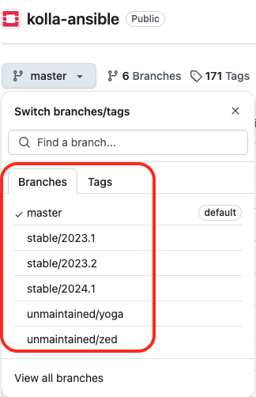

# Chapter 09
## Benchmarking the Infrastructure – Evaluating Resource Capacity and Optimization

## Description

The Chapter extends and uses the deployment of a multi-node OpenStack environment as described in [Chapter03](https://github.com/PacktPublishing/Mastering-OpenStack-Third-Edition/tree/main/Chapter03):
- Add OpenStack database caching  
- Deploy Rally for OpenStack benchmarking
- Add OSProfiler for OpenStack services tracing
- Deploy Watcher


### System and Software Specs:

The chapter uses the same hardware and configuration for multi-node OpenStack setup as deployed in [Chapter03](https://github.com/PacktPublishing/Mastering-OpenStack-Third-Edition/tree/main/Chapter03) and [Chapter07](https://github.com/PacktPublishing/Mastering-OpenStack-Third-Edition/tree/main/Chapter07). 


> [!NOTE]
> The mentioned resources are being used in large production environments. Feel free to adjust the specs based on available resources you have but staying with minimum requirements to avoid performance issues. 


The chapter uses the different tools and software versions:

- **Operating System**: Ubuntu 22.04 LTS
- **kolla-ansible**: Latest and stable version from OpenStack Git master branch  (_Description in next section_)
- **Python**: Version 3.X.X
- **Ansible Core**: Any version between ```2.16```  and ```2.17.99```.
- **Jenkins**: Any version for the latest Ubuntu/Debian Jenkins repository (_Description in next section_)


### Code - How-To:

The Chapter uses the kolla-ansible community [repostority](https://github.com/openstack/kolla-ansible).

Make sure you followed instructions to setup Jenkins and CI/CD pipeline for kolla-ansible deployment in [Chapter02](https://github.com/PacktPublishing/Mastering-OpenStack-Third-Edition/tree/main/Chapter02#3setting-up-the-cicd-pipeline)

Required files are:
- ```ansible/inventory/multi_packtpub_prod``` : Inventory file for multi-node setup
- ```/etc/kolla/globals.yaml``` : OpenStack configurations and parameters 

You can check the branch naming standard used by the OpenStack community in the Github page by clicking on the Switch branches/tags button the top right of the page:



Branches with **stable/** prefix are still maintained. Non maintained OpenStack releases are named with branches with **unmaintained/** prefix.


### Deployment and Configuration of Caching
#### Assumptions:
-  Jenkins installed and running in the Deployer Node as explored in [Chapter02](https://github.com/PacktPublishing/Mastering-OpenStack-Third-Edition/blob/main/Chapter02/README.md#3setting-up-the-cicd-pipeline)
-  A local Docker registry is created as described in [Chapter02](https://github.com/PacktPublishing/Mastering-OpenStack-Third-Edition/blob/main/Chapter02/README.md#2-prepare-the-deployment-environment)


1. Copy the `/ansible/inventory/multi_packtpub_prod` inventory file provided [here](https://github.com/PacktPublishing/Mastering-OpenStack-Third-Edition/blob/main/Chapter09/ansible/inventory/multi_packtpub_prod) that enables caching `memcached` service in the control plane:

```sh
...
[memcached:children]
control
...

```

2. Create/Edit the content of `/etc/kolla/globals.yaml` file provided [here](https://github.com/PacktPublishing/Mastering-OpenStack-Third-Edition/blob/main/Chapter09/etc/kolla/globals.yml). In this chapter the following settings in the `/etc/kolla/globals.yaml` file are used:

```sh
...
###################
# OpenStack options
###################
...
enable_memcached: "yes"
enable_haproxy_memcached: "yes"
...
```

3. Run the Jenkins Pipeline and make sure the new Monitoring node is properly installed:

```sh
..
PLAY RECAP *************************************************************************************************************************************************** 
...
localhost                          : ok=12   changed=0    unreachable=0    failed=0    skipped=87   rescued=0    ignored=0   
...
cc01.os.packtpub                   : ok=10   changed=0    unreachable=0    failed=0    skipped=91   rescued=0    ignored=0 
...
```

> [!IMPORTANT]
> Make sure to commit and push Jenkins pipelines files to your repository with the respective branch.
> e.g: `Jenkinsfile` in this chapter is pushed to a branch named `production` as it targets different environment and not the same as described in `Chapter02`. 


4. After the deployment is finished, check the new containers for Prometheus and Grafana :

```sh
docker ps -a 
```

<details close>
  <summary>Output</summary>

  ```sh
CONTAINER ID     IMAGE                                                                  COMMAND                     CREATED              STATUS                            PORTS     NAMES
...
da5241de225d     registry/openstack.kolla/memcached:master-rocky-9                      "dumb-init--single-.."      1 hour ago           Up 1 hour ago (healthy)                     memcached                                  
...

```
</details>


### Deployment and Configuration of Rally
#### Assumptions:
-  Jenkins installed and running in the Deployer Node as explored in [Chapter02](https://github.com/PacktPublishing/Mastering-OpenStack-Third-Edition/blob/main/Chapter02/README.md#3setting-up-the-cicd-pipeline)
-  A local Docker registry is created as described in [Chapter02](https://github.com/PacktPublishing/Mastering-OpenStack-Third-Edition/blob/main/Chapter02/README.md#2-prepare-the-deployment-environment)


1. Pull and run Rally image for OpenStack:

```sh
docker pull xrally/rally-openstack
```


2.  Create Docker volume for Rally storage backend:

```sh
docker volume create --name rally_storage
```


3. Run the Rally docker container:

```sh
docker run -v rally_storage:/home/rally/.rally xrally/rally-openstack
```


4. Copy/Edit a `deployment.json` file in the Rally container that has different variables defined in the `/etc/kolla/clouds.yaml` file:

```yaml
  {
  "type": "cloud_my",
  "auth_url": "http://<CLOUD_CONTROLLER_IP>:5000/v2.0",
  "region_name": "RegionOne",
  "admin": {
  "username": "<USERNAME>",
  "password": "<PASSWORD>",
  "tenant_name": "<TENANT_NAME>"
    } 
}


```

> [!IMPORTANT]
> Make sure to change the `CLOUD_CONTROLLER_IP`, `USERNAME`, `PASSWORD` and `TENANT_NAME` values as defined in your  `/etc/kolla/clouds.yaml` file.


5. Create Rally deployment and generate local `openrc` file:

```sh
rally deployment create --file=deployment.json --name=perf_cloud
```

6. Source the variables in the `openrc` file:

```sh
source ~/.rally/openrc
```

7. Check the Rally deployment is ready and all OpenStack services are available for benchmarking:

```sh
rally deployment check
```

<details close>
  <summary>Output</summary>

  ```sh
keystone endpoints are valid and following services are available:
+------------+----------------+-----------+
| Service    | Service Type   | Status    |
+------------+----------------+-----------+
| ceilometer | metering       | Available |
| cinder     | volume         | Available |
| cinderv2   | volumev2       | Available |
| cinderv3   | volumev3       | Available |
| glance     | image          | Available |
| heat       | orchestration  | Available |
| gnocchi    | metric         | Available |
| keystone   | identity       | Available |
| nova       | compute        | Available |
| neutron    | network        | Available |
| s3         | s3             | Available |
+----------+----------------+-------------+

```
</details>

8. Copy content of benchmarking scenario available [here](https://github.com/PacktPublishing/Mastering-OpenStack-Third-Edition/blob/main/Chapter09/Rally/perf_keystone_pp.yaml) and run the benchmarking test:

```sh
rally task start --abort-on-sla-failure perf_keystone_pp.yaml
```


### Deployment and Configuration of Profiler
#### Assumptions:
-  Jenkins installed and running in the Deployer Node as explored in [Chapter02](https://github.com/PacktPublishing/Mastering-OpenStack-Third-Edition/blob/main/Chapter02/README.md#3setting-up-the-cicd-pipeline)
-  A local Docker registry is created as described in [Chapter02](https://github.com/PacktPublishing/Mastering-OpenStack-Third-Edition/blob/main/Chapter02/README.md#2-prepare-the-deployment-environment)


1. Create/Edit the content of `/etc/kolla/globals.yaml` file provided [here](https://github.com/PacktPublishing/Mastering-OpenStack-Third-Edition/blob/main/Chapter09/etc/kolla/globals.yml). In this chapter the following settings in the `/etc/kolla/globals.yaml` file are used:

```sh
...
###################
# OpenStack options
###################
...
enable_osprofiler: "yes"
enable_elasticsearch: "yes"
...
```

2. Run the Jenkins Pipeline and make sure the new Monitoring node is properly installed:

```sh
..
PLAY RECAP *************************************************************************************************************************************************** 
...
localhost                          : ok=12   changed=0    unreachable=0    failed=0    skipped=87   rescued=0    ignored=0   
...
cc01.os.packtpub                   : ok=10   changed=0    unreachable=0    failed=0    skipped=91   rescued=0    ignored=0 
...
```

> [!IMPORTANT]
> Make sure to commit and push Jenkins pipelines files to your repository with the respective branch.
> e.g: `Jenkinsfile` in this chapter is pushed to a branch named `production` as it targets different environment and not the same as described in `Chapter02`. 


3. Check the running OSProfiler by generating an example output for the `image list` command line:

```sh
openstack --os-profile <OSPROFILER_SECRET> image list
```

<details close>
  <summary>Output</summary>

  ```sh
+---------------------------------------+----------------+-----------+
| ID                                    | Name           | Status    |
+---------------------------------------+----------------+-----------+
| 5245da263-45a1-35de-2716-f524e2fe3aad | Cirros         | active    |  
+---------------------------------------+----------------+-----------+

```
</details>

> [!IMPORTANT]
> Make sure to change the `OSPROFILER_SECRET` values as defined in your  `/etc/kolla/passwords.yml` file.


### Deployment and Configuration of Watcher
#### Assumptions:
-  Jenkins installed and running in the Deployer Node as explored in [Chapter02](https://github.com/PacktPublishing/Mastering-OpenStack-Third-Edition/blob/main/Chapter02/README.md#3setting-up-the-cicd-pipeline)
-  A local Docker registry is created as described in [Chapter02](https://github.com/PacktPublishing/Mastering-OpenStack-Third-Edition/blob/main/Chapter02/README.md#2-prepare-the-deployment-environment)


1. Copy the `/ansible/inventory/multi_packtpub_prod` inventory file provided [here](https://github.com/PacktPublishing/Mastering-OpenStack-Third-Edition/blob/main/Chapter09/ansible/inventory/multi_packtpub_prod) that enables  `Watcher` service in the control plane:

```sh
...
[watcher:children]
control
[watcher-api:children]
watcher
[watcher-engine:children]
watcher
[watcher-applier:children]
watcher
...

```

2. Create/Edit the content of `/etc/kolla/globals.yaml` file provided [here](https://github.com/PacktPublishing/Mastering-OpenStack-Third-Edition/blob/main/Chapter09/etc/kolla/globals.yml). In this chapter the following settings in the `/etc/kolla/globals.yaml` file are used:

```sh
...
###################
# OpenStack options
###################
...
enable_watcher: "yes
...
```

3. Run the Jenkins Pipeline and make sure the new Monitoring node is properly installed:

```sh
..
PLAY RECAP *************************************************************************************************************************************************** 
...
localhost                          : ok=22   changed=0    unreachable=0    failed=0    skipped=65   rescued=0    ignored=0   
...
cc01.os.packtpub                   : ok=16   changed=0    unreachable=0    failed=0    skipped=96   rescued=0    ignored=0 
...
```


> [!IMPORTANT]
> Make sure to commit and push Jenkins pipelines files to your repository with the respective branch.
> e.g: `Jenkinsfile` in this chapter is pushed to a branch named `production` as it targets different environment and not the same as described in `Chapter02`. 


4. After the deployment is finished, check the new containers for Prometheus and Grafana :

```sh
docker ps -a 
```

<details close>
  <summary>Output</summary>

  ```sh
CONTAINER ID     IMAGE                                                                  COMMAND                     CREATED              STATUS                            PORTS     NAMES
...
652de235fe42     registry/openstack.kolla/watcher:master-rocky-9                        "dumb-init--single-.."      5 minutes ago        Up 2 minutes ago (healthy)                  watcher                                  
...

```
</details>


## Troubleshooting:


