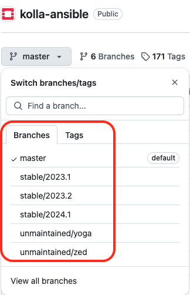

# Chapter 2
Kicking Off the OpenStack Setup – The Right Way (DevSecOps)

## Description

The Chapter initiates the deployment of an OpenStack environment in different steps:
1. Test/Local environment: Running all components discussed in first chapter in a single machine for testing using Vagrant and VirtualBox.
2. Setup a deployer host running a CI/CD Tool using Jenkins 
3. Create CI/CD pipeline for the OpenStack code deployment. 
4. Include a security stage check in the CI/CD pipeline to scan and test OpenStack services running in Kolla containers before proceeding the deployment in the target environment
5. **Bonus Section 1**: Guide through the different requirements to create a first instance.
6. **Bonus Section 2**: Troubleshooting of most encoutred issues when running an OpenStack deployment.  
5. **Bonus Section 3**: 

## 1.Deployment in a Local Environment:
### System and Software Requirements:

To deploy OpenStack in a test/local environment, an environment can be installed in a physical or virtual machine with the following minimum hardware and software pre-requesities:

- **Operating System**: Ubuntu 22.04 LTS
- **CPU**: Minimum of multi-core AMD64 processor with 4 cores
- **RAM**: Minimum of 8GB RAM
- **Disk space**: Minimum of 50 GB free storage (root Disk)

The chapter uses the different tools and software versions:
- **kolla-ansible**: Latest and stable version from OpenStack Git master branch  (_Description in next section_)
- **Python**: Version 3.XX
- **Ansible Core**: Any version between ```2.16```  and ```2.17.99```.
- **Vagrant**: Latest Version  ```2.4.1``` (_At the time of writing this edition_).
- **Jenkins**: Any version for the latest Ubuntu/Debian Jenkins repository (_Description in next section_)


### Code - How-To:

The Chapter uses the kolla-ansible community [repostority](https://github.com/openstack/kolla-ansible).

 Start by cloning the project code from Github:
```
git clone https://github.com/openstack/kolla-ansible.git
```

> [!TIP]
> To maintain own OpenStack infrastructure, create own private repository to reflect own custom configuration and desired infrastructure design state.


You can check the branch naming standard used by the OpenStack community in the Github page by clicking on the Switch branches/tags button the top right of the page:



Branches with **stable/** prefix are still maintained. Non maintained OpenStack releases are named with branches with **unmaintained/** prefix. 

> [!IMPORTANT]
> The cloned code is based on the master branch. OpenStack community keeps maintaining the kolla-ansible code of the latest 3 releases of OpenStack. It is recommended to use the master branch.  

### Code - How-To:

1. Update the package lists from the repositories of Ubuntu OS:
```
$ sudo apt-get update
```

2. Install ```Virtualbox``` in the local machine:
```
$ sudo apt install -y virtualbox virtualbox-ext-pack
```

3. Install the Vagrant version ```2.4.1```:
```
$ wget https://releases.hashicorp.com/vagrant/2.4.1/vagrant-2.4.1-1.x86_64.rpm
$ sudo apt install rpm
$ sudo rpm -i vagrant-2.4.1-1.x86_64.rpm
```

4. Check the installed version of ```vagrant```:
```
$ vagrant version
```

<details close>
  <summary>Output</summary>

  ```sh
Installed Version: 2.4.1
Latest Version: 2.4.1
You're running an up-to-date version of Vagrant!
```
</details>

5. Install ```disksize``` plugin for Vagrant to define disk medium to Vagrant host guests and allow disk resize:

```
$ vagrant plugin install vagrant-disksize
```

6. Create optionally a shared directory for Vagrant guest hosts:

```
$ mkdir openstack_deploy
```

7. Create and copy the content of the Vagrant file named ```Vagrantfile``` provided [here](https://github.com/PacktPublishing/Mastering-OpenStack-Third-Edition/blob/main/Chapter2/Vagrantfile).
<br />

- ```config.vm.box``` : Install Ubuntu 22.04 TLS 
- ```config.disksize.size```: Setup root disk size of 50GB 
- ```config.vm.synced_folder```: Sync directory with local folder ```openstack_deploy```
- ```config.vm.network```: Create 2 interfaces ```eth0``` and ```eth1``` with port forwarding on ports 80 and 8080.
- ```vb.memory```: Set RAM size of 8GB 
- ```vb.cpus```: Set CPU cores of 4 

8. Save the file and run the deployment of the Vagrant guest machine:
```
$ vagrant up
```

<details close>
  <summary>Output</summary>

  ```sh
TBD
```
</details>

9. SSH the Vagrant guest from the local machine (_username/password are NOT required_):

```
$ vagrant ssh
```

<details close>
  <summary>Output</summary>

  ```sh
TBD
```
</details>

10. Once logged in, install the following packages and dependencies:

```
$ sudo -i
# apt update -y
# apt install python3-dev libffi-dev gcc libssl-dev python3-venv
# apt install python3-pip
```

11. Create optionally a Python virtual envionment:

```
# python3 -m venv local
# source local/bin/activate
```

12. Install ```pip```:

```
(local)# pip install -U pip
```

<details close>
  <summary>Output</summary>

  ```sh
TBD
```
</details>

13. Install Ansible core:
```
(local)# pip install 'ansible-core>=2.16,<2.17.99'
```

14. Install kolla-ansible:
```
(local)# pip install git+https://opendev.org/openstack/kolla-ansible@master
(local)# kolla-ansible install-deps
```

<details close>
  <summary>Output</summary>

  ```sh
TBD
```
</details>

15. Create a new directory locally to prepare for the kolla-ansible run:
```
(local)# mkdir -p /etc/kolla
(local)# chown $USER:$USER /etc/kolla
```

16. Step ```14``` should have downloaded example files of kolla-ansibe repository that should be located under ```/local/share/kolla-ansible/```. Copy skeleton files for both `all-in-one` inventory and ```globals.yaml``` files under ```/etc/kolla```directory:

```
(local)# cp -r local/share/kolla-ansible/etc_examples/kolla/* /etc/kolla 
(local)# cp -r /usr/local/share/kolla-ansible/ansible/inventory/* /etc/kolla 
```

17. Create and copy the content of ```/etc/kolla/globals.yaml``` file provided [here](https://github.com/PacktPublishing/Mastering-OpenStack-Third-Edition/blob/main/Chapter2/etc/kolla/globals.yml).
You can also run the following command lines to get the same settings in the ```/etc/kolla/globals.yaml``` file  :
<br />

```
sed -i 's/^#kolla_base_distro:.ls*/kolla_base_distro: "ubuntu"/g' /etc/kolla/globals.yml
sed -i 's/^#enable_haproxy:.*/enable_haproxy: "no"/g' /etc/kolla/globals.yml
sed -i 's/^#network_interface:.*/network_interface: "eth0"/g' /etc/kolla/globals.yml
sed -i 's/^#neutron_external_interface:.*/neutron_external_interface: "eth1"/g' /etc/kolla/globals.yml
sed -i 's/^#kolla_internal_vip_address:.*/kolla_internal_vip_address: "10.0.2.15"/g' /etc/kolla/globals.yml
```

18. Generate the OpenStack services secretes:

```
# kolla-genpwd -p /etc/kolla/passwords.yml
```
<details close>
  <summary>Output</summary>

  ```sh
TBD
```
</details>


19. Bootstrap the OpenStack services in ```all-in-one``` configuration:
```
# kolla-ansible -i /etc/kolla/all-in-one bootstrap-servers
```
<details close>
  <summary>Output</summary>

  ```sh
TBD
```
</details>

20. Run The Pre-checks script in ```all-in-one``` configuration:
```
#  kolla-ansible -i /etc/kolla/all-in-one prechecks
```
<details close>
  <summary>Output</summary>

  ```sh
TBD
```
</details>

21. Run the OpenStack services deployment in ```all-in-one``` configuration:
```
#  kolla-ansible -i /etc/kolla/all-in-one deploy
```
<details close>
  <summary>Output</summary>

  ```sh
TBD
```
</details>


## Troubleshooting:

### VirtualBox installation
### Vagrant installation

### Vagrant disksize plugin: 
Issue with Vagrant version below 2.X.X

### Vagrant configuration 
vagrant reload

### Shared local folder openstack_deploy
mkdir openstack_deploy

### Run Vagrant
vagrant up

Bringing machine 'default' up with 'virtualbox' provider...
==> default: Importing base box 'generic/ubuntu2204'...
Progress: 90%

## Make sure to install Docker
sudo apt-get install python3-dev libffi-dev gcc libssl-dev docker -y  
OR apt install docker.io


### Jenkins
Git authentification access 
jenkins user upgrade to sudoers users with NOPASSW
Add /bin/bash for the Jenkins shell configuration to execute 

### Anchore
https://github.com/anchore/anchore-cli
Entreprise Edition Workaround


## Nova user Guide: Create VM

1. Prepare image using Cirros image (https://docs.openstack.org/mitaka/install-guide-obs/glance-verify.html) (https://docs.openstack.org/image-guide/obtain-images.html#cirros-test)
 the login account is cirros. The password is gocubsgo.

$ wget http://download.cirros-cloud.net/0.3.4/cirros-0.3.4-x86_64-disk.img

2. Upload the image to Glance:

```
$ openstack image create 'Cirros' --file cirros-0.6.2-x86_64-disk.img --disk-format qcow2 --container-format bare --public
```


<details close>
  <summary>Output</summary>

  ```sh

+------------------+--------------------------------------------------------------------------------------------------------------------------------------------+
| Field            | Value                                                                                                                                      |
+------------------+--------------------------------------------------------------------------------------------------------------------------------------------+
| container_format | bare                                                                                                                                       |
| created_at       | 2024-10-17T16:24:34Z                                                                                                                       |
| disk_format      | qcow2                                                                                                                                      |
| file             | /v2/images/a0198d59-6b58-4885-8aa8-cf41dba0a898/file                                                                                       |
| id               | a0198d59-6b58-4885-8aa8-cf41dba0a898                                                                                                       |
| min_disk         | 0                                                                                                                                          |
| min_ram          | 0                                                                                                                                          |
| name             | Cirros                                                                                                                                     |
| owner            | aa7e03d921cb4aec85e7c086abbfb99f                                                                                                           |
| properties       | os_hidden='False', owner_specified.openstack.md5='', owner_specified.openstack.object='images/Cirros', owner_specified.openstack.sha256='' |
| protected        | False                                                                                                                                      |
| schema           | /v2/schemas/image                                                                                                                          |
| status           | queued                                                                                                                                     |
| tags             |                                                                                                                                            |
| updated_at       | 2024-10-17T16:24:34Z                                                                                                                       |
| visibility       | public                                                                                                                                     |
+------------------+--------------------------------------------------------------------------------------------------------------------------------------------+
  ```

</details>

3. Veriy the image:

```
$ openstack image list
```
<details close>
  <summary>Output</summary>

  ```sh
+--------------------------------------+----------------------+--------+
| ID                                   | Name                 | Status |
+--------------------------------------+----------------------+--------+
| a0198d59-6b58-4885-8aa8-cf41dba0a898 | Cirros               | active |
| 9be4165a-45a7-4d55-b2ef-65ed8d243adc | manila-service-image | active |
+--------------------------------------+----------------------+--------+
```
</details>